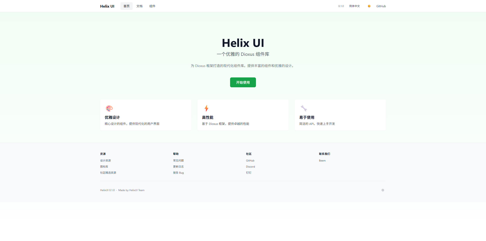
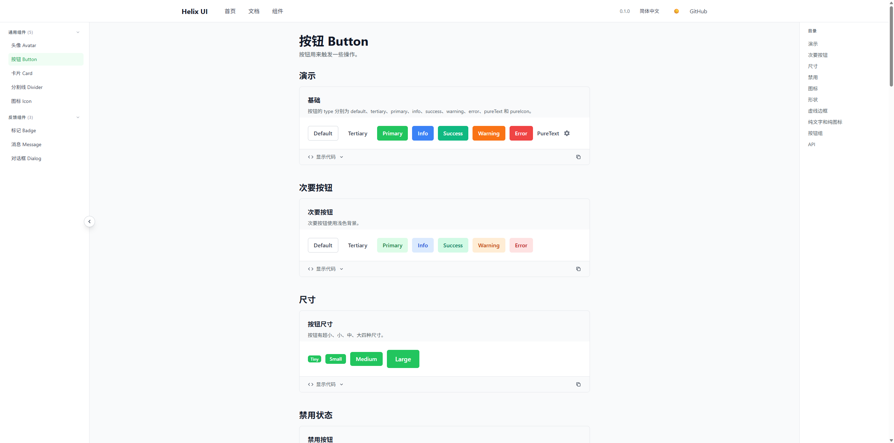
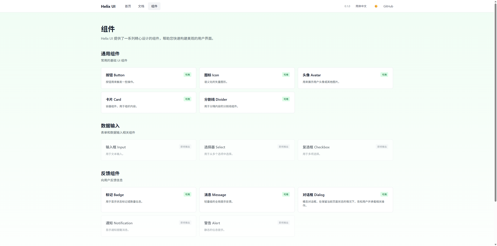
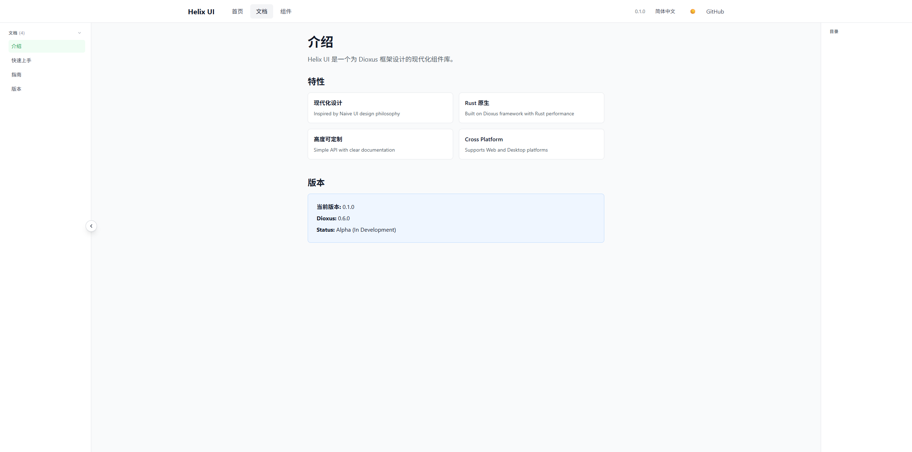

# 🎨 HelixUI

<div align="center">

**一个现代化的 Rust UI 组件库，专为 Dioxus 框架设计**

[](https://www.rust-lang.org/)
[](https://dioxuslabs.com/)
[](https://opensource.org/licenses/MIT)
[](https://crates.io/crates/helixui)
[](https://docs.rs/helixui)

[📖 文档](https://github.com/fangbc5/helixui) • [🎮 在线演示](https://github.com/fangbc5/helixui) • [🐛 问题反馈](https://github.com/fangbc5/helixui/issues) • [💬 讨论](https://github.com/fangbc5/helixui/discussions)

</div>

## ✨ 特性

- 🚀 **高性能** - 基于 Rust 和 Dioxus，提供原生级别的性能
- 🎨 **现代化设计** - 简洁美观的 UI 设计，符合现代审美
- 🌙 **深色模式** - 内置深色模式支持，自动适配系统主题
- 📱 **响应式** - 完全响应式设计，适配各种屏幕尺寸
- 🔧 **类型安全** - 充分利用 Rust 的类型系统，编译时错误检查
- 🎯 **易用性** - 简洁的 API 设计，快速上手
- 🔌 **可扩展** - 模块化设计，易于自定义和扩展
- 📦 **轻量级** - 按需加载，最小化包体积

## 🖼️ 预览

<div align="center">

### 🏠 首页


### 📚 组件文档


### 📋 组件列表


### 📖 文档页面


</div>

## 🏗️ 组件架构

### 📋 组件分类

HelixUI 采用分层架构设计，组件按功能分为以下几类：

#### 🎯 通用组件 (Common Components)
- **Avatar** - 头像组件，支持文字、图片、图标
- **Button** - 按钮组件，支持多种类型和样式
- **Card** - 卡片组件，用于内容展示
- **Divider** - 分割线组件
- **Icon** - 图标组件

#### 💬 反馈组件 (Feedback Components)
采用分层架构设计，实现完美的组件复用：

```
Overlay（Portal + zIndex + 动画）
├── PopupBase（可交互类浮层）
│    ├── Dialog（对话框）
│    │    └── Modal（模态框）
│    └── Drawer / Popover / Tooltip（待实现）
└── NoticeBase（轻提示类浮层）
     ├── Message（消息）
     └── Notification / Snackbar（待实现）
```

**架构优势：**
- 🔄 **完美复用** - 每个组件都基于其父级组件构建，避免重复代码
- 🛡️ **类型安全** - 使用类型别名确保类型一致性
- 🔄 **向后兼容** - 保持原有 API 不变
- 🌐 **跨平台** - 所有组件都支持 Web/Desktop/App
- 📱 **响应式** - 自动适配不同屏幕尺寸
- 🔧 **可扩展** - 易于添加新的子组件

#### 🏷️ 其他组件
- **Badge** - 徽章组件，用于状态标识

### 安装

在你的 `Cargo.toml` 中添加依赖：

```toml
[dependencies]
helixui = "0.1.0"
dioxus = { version = "0.6.0", features = ["web"] }
```

### 基本用法

```rust
use helixui::components::{Button, ButtonType, ButtonVariant, IconType};
use dioxus::prelude::*;

fn App() -> Element {
    rsx! {
        div { class: "p-8 space-y-4",
            // 基础按钮
            Button {
                button_type: ButtonType::Primary,
                "开始使用 HelixUI"
            }
            
            // 图标按钮
            Button {
                button_type: ButtonType::Info,
                variant: ButtonVariant::Icon,
                icon: Some(IconType::Settings),
            }
            
            // 纯文字按钮
            Button {
                button_type: ButtonType::PureText,
                "了解更多"
            }
        }
    }
}
```

## 📦 组件库

### 🎯 通用组件 (Common)

| 组件 | 描述 | 状态 |
|------|------|------|
| **Button** | 多功能按钮组件，支持多种类型和变体 | ✅ |
| **Avatar** | 头像组件，支持图片、图标和文字 | ✅ |
| **Card** | 卡片容器组件 | ✅ |
| **Icon** | 图标组件，内置多种常用图标 | ✅ |
| **Divider** | 分割线组件 | ✅ |

### 💬 反馈组件 (Feedback)

| 组件 | 描述 | 状态 |
|------|------|------|
| **Badge** | 徽章组件，用于状态标识 | ✅ |
| **Dialog** | 对话框组件 | ✅ |
| **Message** | 消息提示组件 | ✅ |

### 🏗️ 布局组件 (Layout)

| 组件 | 描述 | 状态 |
|------|------|------|
| **Navbar** | 导航栏组件 | ✅ |
| **Footer** | 页脚组件 | ✅ |
| **Logo** | Logo 组件 | ✅ |

## 🎨 设计系统

### 颜色主题

HelixUI 提供了一套完整的颜色系统：

- **Primary** - 主要品牌色 (绿色系)
- **Info** - 信息色 (蓝色系)
- **Success** - 成功色 (绿色系)
- **Warning** - 警告色 (橙色系)
- **Error** - 错误色 (红色系)

### 尺寸规范

- **Tiny** - 超小尺寸，适合紧凑布局
- **Small** - 小尺寸，适合移动端
- **Medium** - 中等尺寸，默认大小
- **Large** - 大尺寸，适合桌面端

## 🛠️ 开发

### 环境要求

- Rust 1.70+
- Dioxus 0.6.0+

### 本地开发

```bash
# 克隆项目
git clone https://github.com/fangbc5/helixui.git
cd helixui

# 运行文档网站
cargo run -p helixui-website

# 构建所有项目
cargo build

# 运行测试
cargo test

# 检查代码
cargo check
```

### 项目结构

```
helixui/
├── helixui-lib/          # 核心组件库
│   ├── src/
│   │   ├── components/    # 组件实现
│   │   │   ├── common/    # 通用组件
│   │   │   ├── feedback/  # 反馈组件
│   │   │   └── layout/    # 布局组件
│   │   └── lib.rs
│   └── Cargo.toml
├── helixui-website/       # 文档网站
│   ├── src/
│   │   ├── views/         # 页面视图
│   │   └── main.rs
│   └── Cargo.toml
└── docs/                  # 文档资源
    └── images/           # 截图和图片
```

## 🤝 贡献

我们欢迎所有形式的贡献！无论是代码、文档、设计还是想法。

### 如何贡献

1. **Fork** 这个仓库
2. 创建你的特性分支 (`git checkout -b feature/AmazingFeature`)
3. 提交你的更改 (`git commit -m 'Add some AmazingFeature'`)
4. 推送到分支 (`git push origin feature/AmazingFeature`)
5. 打开一个 **Pull Request**

### 贡献指南

- 📝 **代码规范** - 遵循 Rust 官方代码规范
- 🧪 **测试** - 为新功能添加测试
- 📚 **文档** - 更新相关文档
- 🎨 **设计** - 保持设计一致性

### 开发计划

- [ ] 更多通用组件 (Input, Select, Table 等)
- [ ] 数据展示组件 (Chart, Calendar 等)
- [ ] 导航组件 (Menu, Breadcrumb 等)
- [ ] 表单组件 (Form, Validation 等)
- [ ] 主题定制系统
- [ ] 国际化支持
- [ ] 无障碍访问优化

## 📄 许可证

本项目采用 [MIT 许可证](LICENSE) - 查看 LICENSE 文件了解详情。

## 🙏 致谢

感谢所有为这个项目做出贡献的开发者！

特别感谢：
- [Dioxus](https://dioxuslabs.com/) - 优秀的 Rust 前端框架
- [Tailwind CSS](https://tailwindcss.com/) - 实用的 CSS 框架
- Rust 社区的所有贡献者

## 📞 联系我们

- 📧 Email: fangbaichun@beemwork.com
- 🐛 Issues: [GitHub Issues](https://github.com/fangbc5/helixui/issues)
- 💬 Discussions: [GitHub Discussions](https://github.com/fangbc5/helixui/discussions)

---

<div align="center">

**如果这个项目对你有帮助，请给我们一个 ⭐ Star！**

Made with ❤️ by [fangbc5](https://github.com/fangbc5)

</div>